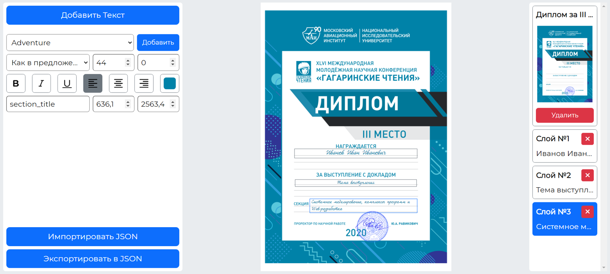

# **certifi-create**  

### Визуальный редактор электронных сертификатов для проекта "Лаборатория конференций — Conflab"

## **Описание**:  

**CertifiCreate** — это визуальный редактор, упрощающий процесс создания шаблонов для автоматической генерации сертификатов для платформы [Conflab](https://conflab.ru/).

## **Функциональность**

1. **Загрузка изображения**:
   - Поддержка перетаскивания изображений или выбора через файловый менеджер.

   - Отображение загруженного изображения в рабочей области для дальнейшего редактирования.

2. **Редактирование текстовых блоков**:
   - Добавление, перемещение и изменение размера текстовых блоков.

   - Настройка текста:

     - Шрифт, размер, стиль (жирный, курсив, подчёркивание).
     - Цвет текста и выравнивание.

   - Позиционирование блоков с помощью координат X и Y.

3. **Экспорт проекта**:

   - Сохранение данных о структуре сертификата в формате JSON.

   - Поддержка пользовательских шрифтов при экспорте.

### **Интерфейс**

Приложение разделено на три основные панели:

- **Левая панель**:

  - Кнопки для добавления текста, загрузки шрифтов и экспорта данных.

  - Инструменты для настройки текстовых блоков.

- **Центральная рабочая область**:

  - Зона для редактирования загруженного изображения и текстовых блоков.

- **Правая панель**:

  - Предварительный просмотр всех добавленных текстовых блоков в виде слоёв.

  - Управление проектом: изменение названия и удаление проекта.

#### **Левая панель**

Левая панель предоставляет инструменты для управления текстовыми блоками:

- **Кнопка "Добавить текст"**: добавляет новый текстовый блок на рабочую область.

- **Настройка текстового блока**:

  - Выпадающий список для выбора шрифта.

  - **Кнопка "Загрузить"**: добавляет пользовательский шрифт.

  - Выпадающий список для выбора регистра.

  - Поле для ввода размера шрифта.

  - Поле для ввода межбуквенного расстояния.

  - Кнопки форматирования текста: **жирный (Bold)**, **курсив (Italic)**, **подчёркивание (Underline)**.

  - Выбор выравнивания текста: **по левому краю**, **по центру**, **по правому краю**.

  - Инструмент выбора цвета текста.

  - Поле для ввода категории текстового блока.

  - Поля для ввода координат X и Y для точного позиционирования текстовых блоков на изображении.

- **Кнопка "Экспортировать в JSON"**: сохраняет данные о структуре сертификата в виде файла JSON.

#### **Рабочая область**

Центральная панель — это основное рабочее пространство:

- **Зона для загрузки изображения**: позволяет загрузить изображение перетаскиванием в область или выбором через файловый менеджер.

- **Редактирование текстовых блоков**:

  - Позиционирование блоков перетаскиванием мышью.

  - Изменение размеров блока растягиванием краев.

  - Редактирование текста в блоке по двойному клику.

- **Интерактивные элементы**:

  - Привязка текстовых блоков к осям и краям изображения для точного выравнивания.

  - Отображение координат при перемещении или изменении размера.

#### **Правая панель**

Правая панель обеспечивает управление слоями и самим проектом:

- **Управление слоями**:

  - Все добавленные текстовые блоки отображаются в виде списка слоёв, которые включают:

    - Номер блока,

    - Текстовое содержимое блока,

    - **Кнопку "х"**: удаляет текстовый блок.

- **Управление проектом**:

  - Миниатюра проекта, которая включает:

    - Название проекта (поддерживает редактирование по двойному клику),

    - Уменьшенное изображение.

  - **Кнопка "Удалить"** : полностью удаляет проект.
